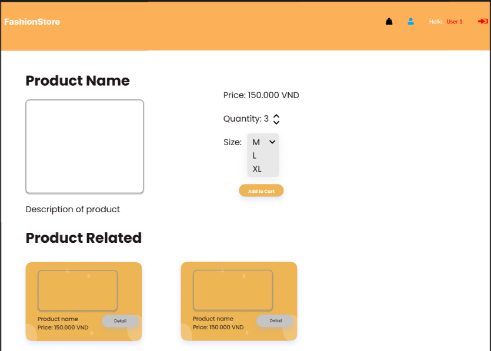

# FashionStore - Online Fashion Shopping

# Team - Group 1

- Nguyễn Quang Huy - (SE160391)
- Nguyễn Việt An - (SE150617)
- Nguyễn Tường Minh - (SE140261)
- Chu Tuấn Kiệt - (SE150863)
-   Đỗ Văn Hiệp - (SE172276)

## Purpose of the System:
FashionStore is an advanced online marketplace that makes it easier for men and women to buy and sell stylish apparel goods. In addition to giving vendors the chance to market and sell their goods to a larger audience, the system seeks to offer consumers an easy-to-use platform for finding and buying apparel items.
Users of the System:

### 1. Customers: Individuals interested in purchasing fashionable clothing items online. 

### 2. Admin: Fashion designers or clothing brands looking to showcase and sell their products.

## System Features:
The user roles are used to categorize the functionalities.

### Customer-Related Features:

#### *1. User Registration and Authentication:

With a username and password, new users can create accounts.
Current clients can safely access their accounts by logging in.

#### *2. Browsing and Shopping:

Consumers can peruse an extensive selection of men's and women's apparel in the catalog.
Sophisticated search features to locate products by brands, categories, keywords, and more.
Comprehensive product pages include pictures, details, costs, and sizes that are available.
the capability of adding goods to the shopping basket.

#### *3. Shopping Cart:

Customers can view their cart contents, adjust quantities, and remove items.

#### *4. Order History:

Access to order history and details of past orders.

### Admin-related features:

#### *1. Login and verify the Admin:

Fashion designers and brands can apply to become Admin.
Verification process to ensure Admin authenticity.

#### *2. Product management:

Admin can list their clothing items with pictures, descriptions, prices, and sizes.
Manage inventory and product availability.
Update or deactivate the list as needed.

#### *3. Admin Dashboard and manage order:

Admin has access to a personalized dashboard to manage order history.

## SiteMap

## WireFrame (Gui)

### Role Customer: 

### Login Page

### Register Page

### Home Page (Not Login)

### Home Page

### Detail Product Page

### Cart Page

### Profile Page

### OrderHistory Page

### Role Admin: 

### Admin DashBoard Page

### Add Product Page

### Edit Page

### OrderHistory Admin Page

## Figma
**Click here: [Figma](https://www.figma.com/file/na3WEHGC1Gphvz0kmEDOno/Fashion-Store?type=design&node-id=0%3A1&mode=design&t=mtUmzcY5a7j0dJ66-1)**

## Database

## Controller, DAO, DTO and Other

## View

## Conclusion

### Achieve
Understand the structure and components of a website.
Known the steps to create a website with java and servlets.
Understand and use MVC structure.
### Points to improve
Points to improve:
Add missing functions.
Optimize and standardize the naming of variables and names.
Practice using git and github fluently.

